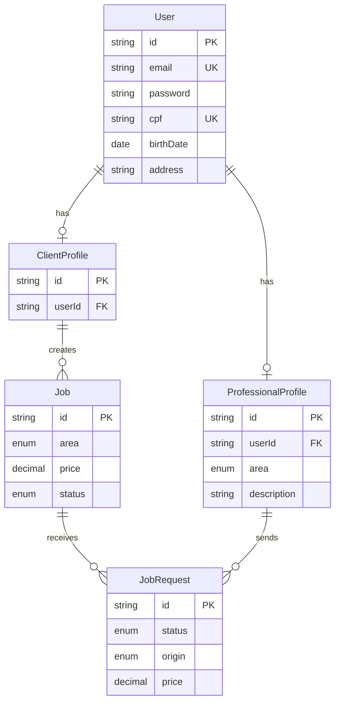
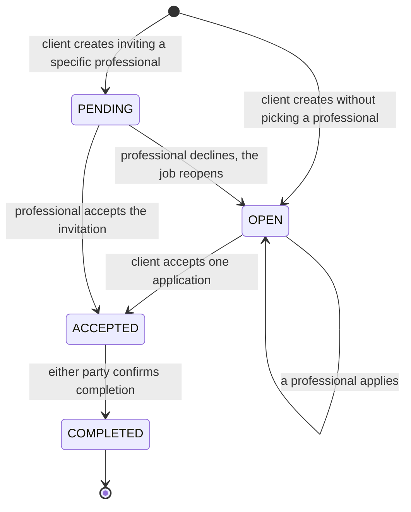

# Horalis

**An organized schedule, clear agreements.**

A platform where clients propose a service — with a description, a price and a category — and
professionals accept or decline in one click. No negotiation buried in chat history, no confusion
about who agreed to what.

🇧🇷 [Leia em português](./README.md)

---

## About the project

Booking independent professionals (barbers, estheticians, physiotherapists, therapists) usually
happens over chat, where price, scope and schedule get lost in the thread. Horalis turns that
negotiation into an object with explicit state: a **job** that is created, receives applications
or a direct invitation, gets accepted by one of the parties, and ends as completed.

There are two roles, each with its own dashboard:

- **Client** — creates jobs, picks among applicants and confirms completion.
- **Professional** — receives direct invitations, applies to open jobs in their category and
  follows their history.

The same person can hold both profiles under a single account.

## Demo

| Role | Email | Password |
| --- | --- | --- |
| Client | `cliente@horalis.dev` | `demo12345` |
| Professional | `profissional@horalis.dev` | `demo12345` |

Demo data is created by [`prisma/seed.ts`](apps/backend/prisma/seed.ts) and covers all four job
states, including an open job with three competing applications.

> The application interface is in Brazilian Portuguese.

## Stack

### Frontend

| Technology | Version | Role |
| --- | --- | --- |
| **TypeScript** | 5 | Language, in `strict` mode |
| **Next.js** | 16.3 | App Router, Server and Client Components |
| **React** | 19.2 | UI library |
| **Tailwind CSS** | 4 | Styling, on top of CSS-variable design tokens |
| **Sass** | 1.102 | `globals.scss` holding tokens and layers |
| **Radix UI** | — | Accessible primitives: Dialog, Select, Popover, Tooltip |
| **react-day-picker** | 10 | Calendar behind `DateInput`, restyled with project tokens |
| **date-fns** | 4 | Date parsing and formatting with pt-BR locale |
| **react-imask** | 7 | Masks for national ID, phone, postal code and currency |
| **cpf-cnpj-validator** | 2 | Checksum validation for Brazilian national IDs |
| **cep-promise** | 4 | Address autofill from postal code |
| **lucide-react** | 1.31 | Icons |
| **sonner** | 2 | Toast notifications |

### Backend

| Technology | Version | Role |
| --- | --- | --- |
| **TypeScript** | 5.7 | Language |
| **NestJS** | 11 | HTTP framework, dependency injection, modules |
| **Prisma** | 7.9 | ORM and migrations, using the `pg` driver adapter |
| **PostgreSQL** | 16 | Database |
| **Passport + JWT** | — | Stateless authentication |
| **class-validator** | 0.15 | Declarative validation for DTOs and environment variables |
| **bcrypt** | 6 | Password hashing |
| **Helmet** | 8 | HTTP security headers |
| **Swagger** | 11.4 | API documentation at `/api/docs` |
| **Jest** | 30 | Unit and e2e tests |

### Infrastructure

Docker Compose for local PostgreSQL, and GitHub Actions for CI — lint, typecheck, tests and build
for both apps on every push and pull request.

---

## Architecture

### Overview

A monorepo with two **independent** applications, each with its own `package.json` and lockfile.
There is deliberately no shared workspace: each app can be built and deployed on its own — the
frontend on an edge platform, the backend on a container service.

```
schedule-platform/
├── apps/
│   ├── frontend/                 # Next.js (App Router)
│   │   └── src/
│   │       ├── app/              # routes: (auth), create, dashboard
│   │       ├── components/
│   │       │   ├── ui/           # primitives: Input, Select, Modal, DateInput...
│   │       │   └── dashboard/    # domain components
│   │       ├── services/         # HTTP calls grouped by domain
│   │       ├── hooks/            # e.g. useCepLookup
│   │       ├── lib/              # HTTP client and formatters
│   │       ├── types/            # contracts shared with the API
│   │       └── constants/
│   │
│   └── backend/                  # NestJS
│       ├── prisma/               # schema, migrations and seed
│       └── src/
│           ├── common/           # guards, filters, interceptors, decorators
│           ├── config/           # configuration and env validation
│           ├── prisma/           # PrismaService (global module)
│           └── modules/          # auth, user, professional, job, health
│
├── docker-compose.yml            # PostgreSQL for development
└── .github/workflows/ci.yml
```

### Domain model

The central structural decision is separating **identity** from **role**.



`User` holds credentials and personal data; the profiles hold only what is specific to each role.
What this buys in practice:

- **One credential per person.** The same email cannot exist twice with different passwords.
- **Roles stack.** A barber can hire a physiotherapist without creating a second account.
- **No duplication.** Name, national ID and address live in exactly one place.

The constraint it imposes: `Job.clientId` references `ClientProfile.id`, **not** `User.id`. That
is why the JWT carries both identifiers — see the authentication section.

### Job lifecycle

All business rules live in [`job.service.ts`](apps/backend/src/modules/job/job.service.ts), with
transitions guarded by transactions.



Two guarantees enforced by the service:

- Accepting one application **rejects every other pending application** for that job in the same
  transaction, and the job price becomes the price proposed by the accepted professional.
- Only the invited professional may answer an invitation, and only the job owner may choose among
  applicants. Anyone outside the job gets `403`.

`JobStatus` also declares `CANCELLED`, but **no cancellation transition is implemented** — it is
a placeholder, not a reachable state today.

### Authentication and authorization

Stateless JWT authentication. Login takes the desired role and returns a token carrying four
pieces of information:

```ts
{
  sub: string;        // User.id
  email: string;
  role: 'client' | 'professional';
  profileId: string;  // ClientProfile.id OR ProfessionalProfile.id
}
```

`profileId` solves the problem described above: job queries use the **profile** id, and since both
are `cuid` strings, swapping one for the other would not raise a type error — it would silently
return nothing. Carrying both in the token removes the ambiguity.

Authorization runs through two global guards, in this order:

1. **`JwtAuthGuard`** — validates the token and populates `request.user`. Routes marked
   `@Public()` are skipped.
2. **`RolesGuard`** — reads `@Roles('client')` or `@Roles('professional')` from the handler and
   compares it against the role in the token.

Order matters: the second guard depends on the `request.user` the first one sets.

### Cross-cutting layer

- **`HttpExceptionFilter`** — maps Prisma errors to meaningful HTTP status codes: `P2002` becomes
  `409`, `P2025` becomes `404`, `P2003` becomes `400`. Unmapped errors become `500` without
  leaking internals.
- **`LoggingInterceptor`** — logs method, route and response time.
- **`ClassSerializerInterceptor`** with `@Exclude()`-annotated entities — guarantees the password
  hash never reaches a response.
- **`validateEnv`** — validates environment variables at startup. If `JWT_SECRET` is shorter than
  32 characters or `JWT_EXPIRES_IN` does not match the expected format, the app refuses to boot.

### Frontend design system

Visual tokens live as CSS custom properties in
[`globals.scss`](apps/frontend/src/app/globals.scss), in the `oklch` color space. Components under
`components/ui/` consume those tokens through Tailwind utilities, keeping theme and components
decoupled — including the `DateInput` calendar, which does not load the library's default
stylesheet.

---

## API

Prefixed with `/api`. Interactive documentation at `/api/docs` outside production.

| Method | Route | Role | Description |
| --- | --- | --- | --- |
| `POST` | `/auth/login` | public | Authenticates, returns token and session profile |
| `POST` | `/user` | public | Creates an account with the chosen profile |
| `GET` | `/user/me` | authenticated | Own account data |
| `PATCH` | `/user/me` | authenticated | Updates own account |
| `GET` | `/professional` | client | Lists professionals, filterable by category |
| `GET` | `/job` | professional | Open jobs in the professional's category |
| `POST` | `/job` | client | Creates a job |
| `GET` | `/job/client` | client | Jobs owned by the authenticated client |
| `GET` | `/job/professional` | professional | Requests for the authenticated professional |
| `POST` | `/job/:id/request` | professional | Applies to an open job |
| `PATCH` | `/job/request/:id/professional-response` | professional | Accepts or declines an invitation |
| `PATCH` | `/job/request/:id/client-response` | client | Accepts or declines an application |
| `PATCH` | `/job/:id/complete` | authenticated | Marks the job as completed |
| `GET` | `/health` · `/health/db` | public | Health checks |

---

## Running locally

**Requirements:** Node.js 22 and Docker.

### 1. Database

```bash
docker compose up -d
```

Starts PostgreSQL 16 on `localhost:5432`, matching the example environment file.

### 2. Backend — port 3001

```bash
cd apps/backend
cp .env.example .env
```

Generate a secret and fill in `JWT_SECRET` in `.env`:

```bash
node -e "console.log(require('crypto').randomBytes(48).toString('base64url'))"
```

```bash
npm install && npm run prisma:migrate && npx prisma db seed && npm run start:dev
```

### 3. Frontend — port 3000

```bash
cd apps/frontend
cp .env.local.example .env.local
npm install && npm run dev
```

---

## Quality

```bash
npm run typecheck   # type checking, no emit
npm run lint        # ESLint + Prettier
npm test            # Jest
npm run build       # production build
```

CI runs these steps for both apps on every push and pull request, with dependency caching and
automatic cancellation of superseded runs.

---

## Decisions and known limitations

Stated explicitly, because a project with no declared limitations is usually a project with
unnoticed ones.

- **Monorepo without a workspace.** Each app installs its own dependencies. It duplicates
  `node_modules`, but keeps deployments genuinely independent.
- **Driver adapter instead of the binary engine.** Prisma 7 runs with `@prisma/adapter-pg`, so
  queries go through the `pg` driver in JavaScript. The `datasource` declares no `url`: the
  connection is injected into `PrismaClient`.
- **Token stored in a JavaScript-readable cookie.** Not `HttpOnly` yet; changing that requires
  moving token issuance to the server.
- **Password recovery disabled.** The route existed without proof of email ownership and was
  removed. The correct single-use-token flow is still pending.
- **No pagination** on most listings.
- **Test coverage limited to health checks.** The `JobService` state transitions are the natural
  next target.

---

## License

Portfolio project, no usage license defined.
