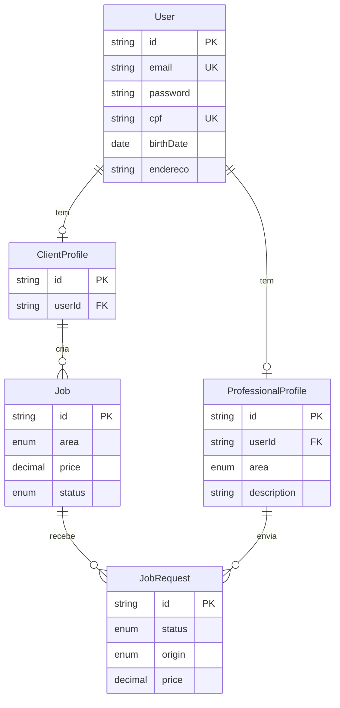
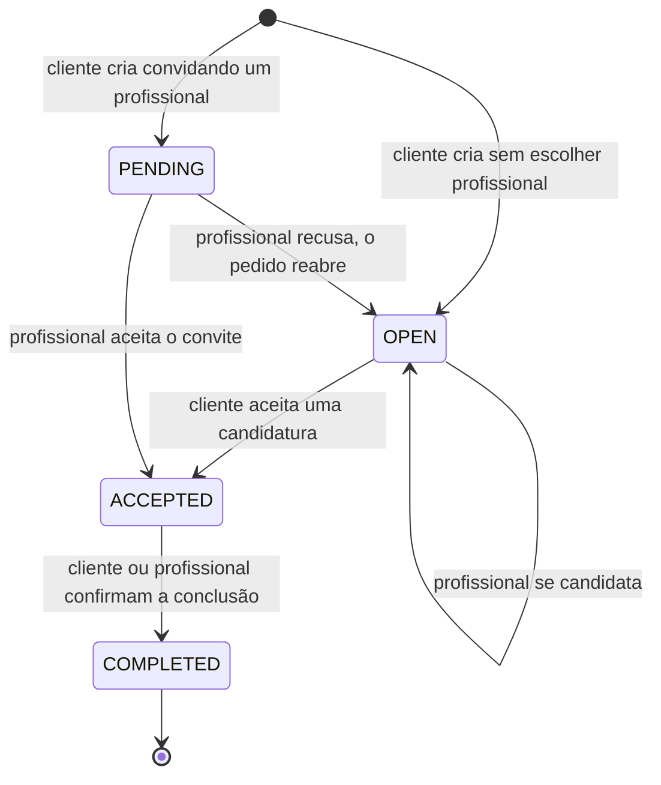

# Horalis

**Agenda organizada, acordos claros.**

Plataforma onde clientes propõem um serviço — com descrição, valor e área — e profissionais
aceitam ou recusam em um clique. Sem negociação perdida em mensagens, sem confusão de horário.

🇬🇧 [Read this in English](./README.en.md)

---

## Sobre o projeto

O fluxo de contratação de serviços autônomos (barbearia, estética, fisioterapia, psicologia)
costuma acontecer em conversas de WhatsApp, onde valor, escopo e horário se perdem no meio do
histórico. O Horalis transforma essa negociação em um objeto com estado explícito: um **pedido**
que nasce, recebe candidaturas ou um convite direto, é aceito por uma das partes e termina
concluído.

Existem dois papéis, cada um com seu painel:

- **Cliente** — cria pedidos, escolhe entre candidatos e confirma a conclusão.
- **Profissional** — recebe convites diretos, candidata-se a pedidos abertos da sua área e
  acompanha o histórico.

Uma mesma pessoa pode ter os dois perfis na mesma conta.

## Demonstração

| Perfil | E-mail | Senha |
| --- | --- | --- |
| Cliente | `cliente@horalis.dev` | `demo12345` |
| Profissional | `profissional@horalis.dev` | `demo12345` |

Os dados de demonstração são criados por [`prisma/seed.ts`](apps/backend/prisma/seed.ts) e cobrem
os quatro estados de um pedido, incluindo um pedido aberto com três candidaturas concorrentes.

## Stack

### Frontend

| Tecnologia | Versão | Papel |
| --- | --- | --- |
| **TypeScript** | 5 | Linguagem, em modo `strict` |
| **Next.js** | 16.3 | App Router, Server e Client Components |
| **React** | 19.2 | Biblioteca de UI |
| **Tailwind CSS** | 4 | Estilização, sobre design tokens em CSS variables |
| **Sass** | 1.102 | `globals.scss` com os tokens e camadas |
| **Radix UI** | — | Primitivos acessíveis: Dialog, Select, Popover, Tooltip |
| **react-day-picker** | 10 | Calendário do `DateInput`, estilizado com os tokens do projeto |
| **date-fns** | 4 | Parsing e formatação de datas com locale pt-BR |
| **react-imask** | 7 | Máscaras de CPF, telefone, CEP e moeda |
| **cpf-cnpj-validator** | 2 | Validação de dígito verificador de CPF |
| **cep-promise** | 4 | Autopreenchimento de endereço por CEP |
| **lucide-react** | 1.31 | Ícones |
| **sonner** | 2 | Notificações |

### Backend

| Tecnologia | Versão | Papel |
| --- | --- | --- |
| **TypeScript** | 5.7 | Linguagem |
| **NestJS** | 11 | Framework HTTP, injeção de dependências, módulos |
| **Prisma** | 7.9 | ORM e migrations, com driver adapter para `pg` |
| **PostgreSQL** | 16 | Banco de dados |
| **Passport + JWT** | — | Autenticação stateless |
| **class-validator** | 0.15 | Validação declarativa de DTOs e de variáveis de ambiente |
| **bcrypt** | 6 | Hash de senhas |
| **Helmet** | 8 | Cabeçalhos de segurança HTTP |
| **Swagger** | 11.4 | Documentação da API em `/api/docs` |
| **Jest** | 30 | Testes unitários e e2e |

### Infraestrutura

Docker Compose para o PostgreSQL local e GitHub Actions para CI (lint, typecheck, testes e build
dos dois apps a cada push e pull request).

---

## Arquitetura

### Visão geral

Monorepo com dois aplicativos **independentes**, cada um com seu próprio `package.json` e
lockfile. Não há workspace compartilhado, e isso é intencional: cada app pode ser construído e
implantado isoladamente — o frontend em uma plataforma de edge, o backend em um serviço de
containers.

```
schedule-platform/
├── apps/
│   ├── frontend/                 # Next.js (App Router)
│   │   └── src/
│   │       ├── app/              # rotas: (auth), create, dashboard
│   │       ├── components/
│   │       │   ├── ui/           # primitivos: Input, Select, Modal, DateInput...
│   │       │   └── dashboard/    # componentes de domínio
│   │       ├── services/         # chamadas HTTP por domínio
│   │       ├── hooks/            # ex.: useCepLookup
│   │       ├── lib/              # cliente HTTP e formatadores
│   │       ├── types/            # contratos compartilhados com a API
│   │       └── constants/
│   │
│   └── backend/                  # NestJS
│       ├── prisma/               # schema, migrations e seed
│       └── src/
│           ├── common/           # guards, filters, interceptors, decorators
│           ├── config/           # configuração e validação de env
│           ├── prisma/           # PrismaService (módulo global)
│           └── modules/          # auth, user, professional, job, health
│
├── docker-compose.yml            # PostgreSQL para desenvolvimento
└── .github/workflows/ci.yml
```

### Modelo de domínio

A decisão estrutural central é a separação entre **identidade** e **papel**.



`User` guarda credenciais e dados pessoais; os perfis guardam apenas o que é específico de cada
papel. As vantagens práticas dessa modelagem:

- **Uma credencial por pessoa.** Não existe o mesmo e-mail cadastrado duas vezes com senhas
  diferentes.
- **Papéis acumuláveis.** Uma barbeira pode contratar uma fisioterapeuta sem criar outra conta.
- **Sem duplicação.** Nome, CPF e endereço existem em um lugar só.

O detalhe que isso impõe: `Job.clientId` referencia `ClientProfile.id`, **não** `User.id`. Por
isso o token JWT carrega os dois identificadores — veja a seção de autenticação.

### Ciclo de vida de um pedido

Toda a regra de negócio vive em [`job.service.ts`](apps/backend/src/modules/job/job.service.ts),
com transições protegidas por transação.



Duas garantias que o serviço aplica:

- Ao aceitar uma candidatura, **todas as outras candidaturas pendentes daquele pedido são
  recusadas** na mesma transação, e o preço do pedido passa a ser o preço proposto pelo
  profissional aceito.
- Só o profissional-alvo pode responder a um convite, e só o dono do pedido pode escolher entre
  candidatos. Quem não faz parte do pedido recebe `403`.

O enum `JobStatus` também declara `CANCELLED`, mas **nenhuma transição de cancelamento está
implementada** — é um espaço reservado, não um estado alcançável hoje.

### Autenticação e autorização

Autenticação stateless com JWT. O login recebe o papel desejado e devolve um token com quatro
informações:

```ts
{
  sub: string;        // User.id
  email: string;
  role: 'client' | 'professional';
  profileId: string;  // ClientProfile.id OU ProfessionalProfile.id
}
```

`profileId` é o que resolve o problema descrito acima: as consultas de pedidos usam o id do
**perfil**, e como ambos são `cuid`, trocar um pelo outro não geraria erro de tipo — apenas
consultas que não encontram nada. Carregar os dois no token elimina a ambiguidade.

A autorização acontece em dois guards globais, nesta ordem:

1. **`JwtAuthGuard`** — valida o token e popula `request.user`. Rotas marcadas com `@Public()`
   são liberadas.
2. **`RolesGuard`** — lê o `@Roles('client')` ou `@Roles('professional')` do handler e compara
   com o papel do token.

A ordem importa: o segundo guard depende do `request.user` que o primeiro preenche.

### Camada transversal

- **`HttpExceptionFilter`** — traduz erros do Prisma para HTTP semântico: `P2002` vira `409`,
  `P2025` vira `404`, `P2003` vira `400`. Erros não mapeados viram `500` sem vazar detalhes.
- **`LoggingInterceptor`** — registra método, rota e tempo de resposta.
- **`ClassSerializerInterceptor`** com entidades marcadas por `@Exclude()` — garante que o hash
  de senha nunca chegue a uma resposta.
- **`validateEnv`** — valida as variáveis de ambiente na inicialização. Se `JWT_SECRET` tiver
  menos de 32 caracteres ou `JWT_EXPIRES_IN` não casar com o formato esperado, a aplicação não
  sobe.

### Design system do frontend

Os tokens visuais vivem como CSS custom properties em
[`globals.scss`](apps/frontend/src/app/globals.scss), em espaço de cor `oklch`. Os componentes de
`components/ui/` consomem esses tokens via classes utilitárias do Tailwind, o que mantém tema e
componentes desacoplados — inclusive o calendário do `DateInput`, que não usa a folha de estilo
padrão da biblioteca.

---

## API

Prefixo `/api`. Documentação interativa em `/api/docs` fora de produção.

| Método | Rota | Papel | Descrição |
| --- | --- | --- | --- |
| `POST` | `/auth/login` | público | Autentica e devolve token + perfil de sessão |
| `POST` | `/user` | público | Cria conta com o perfil escolhido |
| `GET` | `/user/me` | autenticado | Dados da própria conta |
| `PATCH` | `/user/me` | autenticado | Atualiza a própria conta |
| `GET` | `/professional` | cliente | Lista profissionais, com filtro por área |
| `GET` | `/job` | profissional | Pedidos abertos na área do profissional |
| `POST` | `/job` | cliente | Cria um pedido |
| `GET` | `/job/client` | cliente | Pedidos do cliente autenticado |
| `GET` | `/job/professional` | profissional | Solicitações do profissional autenticado |
| `POST` | `/job/:id/request` | profissional | Candidata-se a um pedido aberto |
| `PATCH` | `/job/request/:id/professional-response` | profissional | Aceita ou recusa um convite |
| `PATCH` | `/job/request/:id/client-response` | cliente | Aceita ou recusa uma candidatura |
| `PATCH` | `/job/:id/complete` | autenticado | Marca o pedido como concluído |
| `GET` | `/health` · `/health/db` | público | Verificações de saúde |

---

## Como rodar

**Pré-requisitos:** Node.js 22 e Docker.

### 1. Banco de dados

```bash
docker compose up -d
```

Sobe um PostgreSQL 16 em `localhost:5432` já compatível com o `.env` de exemplo.

### 2. Backend — porta 3001

```bash
cd apps/backend
cp .env.example .env
```

Gere um segredo e preencha `JWT_SECRET` no `.env`:

```bash
node -e "console.log(require('crypto').randomBytes(48).toString('base64url'))"
```

```bash
npm install && npm run prisma:migrate && npx prisma db seed && npm run start:dev
```

### 3. Frontend — porta 3000

```bash
cd apps/frontend
cp .env.local.example .env.local
npm install && npm run dev
```

---

## Qualidade

```bash
npm run typecheck   # verificação de tipos, sem emitir
npm run lint        # ESLint + Prettier
npm test            # Jest
npm run build       # build de produção
```

O CI executa esses passos para os dois apps a cada push e pull request, com cache de dependências
e cancelamento automático de execuções obsoletas.

---

## Decisões e limitações conhecidas

Escrito de forma explícita, porque um projeto sem limitações declaradas costuma ser um projeto
com limitações não percebidas.

- **Monorepo sem workspace.** Cada app instala suas próprias dependências. Duplica `node_modules`,
  mas mantém os deploys realmente independentes.
- **Driver adapter em vez do engine binário.** O Prisma 7 é usado com `@prisma/adapter-pg`, então
  as consultas passam pelo driver `pg` em JavaScript. O `datasource` não declara `url`: a conexão
  é injetada no `PrismaClient`.
- **Token em cookie legível por JavaScript.** Ainda não é `HttpOnly`; migrar exige mover a emissão
  do token para o servidor.
- **Recuperação de senha desativada.** A rota existia sem verificação de posse do e-mail e foi
  removida. O fluxo correto, com token de uso único, está pendente.
- **Sem paginação** na maior parte das listagens.
- **Cobertura de testes concentrada em health check.** As transições de estado do
  `JobService` são o próximo alvo natural.

---

## Licença

Projeto de portfólio, sem licença de uso definida.
